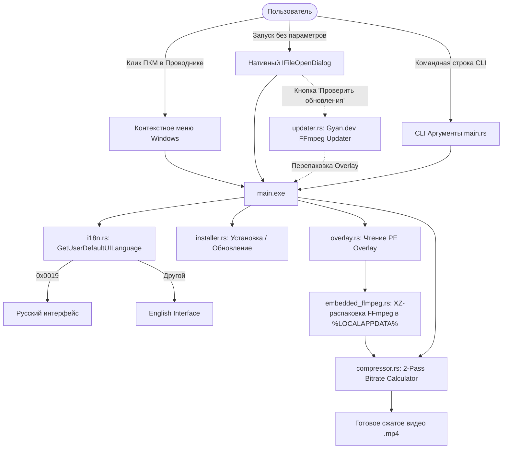

# Архитектура и структура проекта ClipShrinker

## Дерево каталогов и назначение модулей

```
ClipShrinker/
├── .gitignore              # Исключение артефактов компиляции и тяжелых медиафайлов
├── Cargo.toml              # Метаданные Rust пакета clip_shrinker v9.0.2
├── Cargo.lock              # Зафиксированные версии зависимостей
├── build.rs                # Сборщик ресурсов Windows (встраивание app_icon.ico)
├── pack.ps1                # Автоматический скрипт упаковки PE Overlay релиза
├── app_icon.ico            # Высококачественная векторная иконка приложения
├── PROJECT_GOAL.md         # Цели, метрики KPI, скоуп и миссия проекта
├── README.md               # Главная витрина проекта (EN / RU)
├── STRUCTURE.md            # Данный документ архитектуры
├── BUILD.md                # Инструкции по сборке, архивации и тестированию
├── CHANGELOG.md            # Журнал изменений по SemVer
└── src/
    ├── main.rs             # Точка входа: парсер CLI, управление консолью, маршрутизация
    ├── i18n.rs             # Интернационализация (RU / EN) через GetUserDefaultUILanguage
    ├── compressor.rs       # Ядро вычисления битрейтов, запуск 1-pass/2-pass x264/AAC
    ├── dialog.rs           # Кастомный IFileOpenDialog с сабклассингом DirectUI и комбобоксами
    ├── input_box.rs        # Модальное нативное Win32 окно для ввода произвольного размера
    ├── registry.rs         # Управление каскадным контекстным меню Проводника (HKCU)
    ├── installer.rs        # Установка в %LOCALAPPDATA%\ClipShrinker и запись в Uninstall
    ├── embedded_ffmpeg.rs  # Распаковка и проверка кэша встроенного FFmpeg
    ├── overlay.rs          # Низкоуровневая работа с форматом PE Overlay (чтение/запись футера)
    └── updater.rs          # Модуль проверки обновлений FFmpeg с gyan.dev и самообновления
```

---

## Архитектурная схема (Mermaid Diagram)



---

## Описание ключевых подсистем

1. **PE Overlay Payload Architecture (`overlay.rs`, `embedded_ffmpeg.rs`):**
   - Настоящий исполняемый код Rust компилируется в компактный PE-стаб (~500 КБ).
   - В оверлей PE-файла (после секций заголовка PE) дописывается XZ-сжатый бинарник `ffmpeg.exe` и 32-байтный бинарный футер с контрольной сигнатурой `PE_OVERLAY_V1`.
   - При запуске программа мгновенно верифицирует свой футер, извлекает FFmpeg в защищенную папку пользователя и кэширует его.

2. **Интернационализация нулевого оверхеда (`i18n.rs`):**
   - Использует системный Win32 вызов `GetUserDefaultUILanguage()`, не требуя внешних `.mo` или `.json` файлов.
   - Поддерживает переопределение через переменную среды `CLIPSHRINKER_LANG=ru|en` для тестирования.

3. **Расчёт битрейта и двухпроходное сжатие (`compressor.rs`):**
   - Целевой битрейт видео:
     $$\text{Bitrate}_{\text{video}} = \frac{\text{TargetBytes} \times 0.97 \times 8}{\text{Duration}} - \text{Bitrate}_{\text{audio}}$$
   - Автоматический выбор между быстрым 1-проходным кодированием и точным 2-проходным кодированием.
