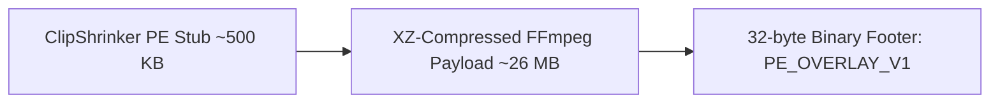

# ClipShrinker 🎬✂️

> **Fast, standalone Windows utility to compress videos to an exact target file size in one click.**  
> Zero dependencies, embedded FFmpeg via PE Overlay, Explorer cascading right-click context menu, and bilingual (EN/RU) support.

[](https://github.com/)
[-0078D6.svg?logo=windows)]()
[]()
[]()

[English](#features) | [Русский](#руководство-пользователя-на-русском-языке)

---

## 🌟 Key Features

* **Exact Target Size in Megabytes:** Squeeze any video precisely to 1, 2, 3, 5, 7, 10, 15, 25, 50, 100 MB or any custom MB size for Discord, Telegram, Email, Slack, or web forms.
* **Single Standalone Executable (~26.7 MB):** No external dependencies, no Python, no .NET, and no manual FFmpeg PATH setup. FFmpeg is embedded directly inside the binary using a high-efficiency PE Overlay (XZ-compressed).
* **Cascading Right-Click Context Menu:** Right-click any video in Windows Explorer $\rightarrow$ **Compress Video** $\rightarrow$ select your target preset.
* **Native Windows File Picker:** Running the program without arguments launches the native Windows `IFileOpenDialog` with custom embedded drop-down menus for **Target Size** and **Scale (100%..25%)**, pixel-perfect aligned with DirectUI.
* **Zero Console Window Flicker:** Runs as a native GUI subsystem (`#![windows_subsystem = "windows"]`). Clean dialogs without annoying black CMD flash.
* **Automatic Dual-Language Support (i18n):** Automatically detects installed Windows UI language via `GetUserDefaultUILanguage()`. Russian on Russian Windows; English on all other systems worldwide.
* **Self-Updating FFmpeg Engine:** Check for and download upstream FFmpeg builds from Gyan.dev in one click without recompiling the program.
* **Clean Windows Integration:** Registers in Windows **Installed Apps (Add/Remove Programs)** with custom icon and uninstalls cleanly without leaving leftover files.
* **Smart Encoding Pipeline:** Automatic 1-pass for high-bitrate / short clips and 2-pass x264/AAC for exact byte limits with adaptive downscaling to prevent pixelation.

---

## 🚀 Quick Start

1. Download `ClipShrinker.exe` from [Releases](https://github.com/).
2. Run `ClipShrinker.exe`:
   - It will prompt to install itself to `%LOCALAPPDATA%\ClipShrinker` and add the **Compress Video** context menu to Explorer.
3. Right-click any video file (`.mp4`, `.mov`, `.mkv`, `.avi`, `.webm`, etc.) and pick a target size!

---

## 💻 CLI Usage

ClipShrinker can also be used directly from Command Prompt or PowerShell:

```cmd
# Open GUI picker with target size and scale dropdowns:
ClipShrinker.exe

# Compress video to default 10 MB:
ClipShrinker.exe "input.mp4"

# Compress video to exact 8 MB (Discord limit):
ClipShrinker.exe "input.mp4" --target 8

# Compress to 25 MB with 50% visual downscale:
ClipShrinker.exe "input.mp4" --target 25 --scale 50%

# Prompt interactive dialog for custom size:
ClipShrinker.exe "input.mp4" --manual

# Register context menu and install app:
ClipShrinker.exe --register

# Full uninstallation from Windows:
ClipShrinker.exe --uninstall
```

---

## 🏗️ Architecture: PE Overlay Payload



When started, `ClipShrinker` verifies its own binary signature, unpacks FFmpeg into `%LOCALAPPDATA%\ClipShrinker` on first run, and caches it. When an update is released by Gyan.dev, ClipShrinker downloads the new FFmpeg release, compresses it to XZ on-the-fly, and rewrites its own PE Overlay without requiring compiler toolchains.

---

<br>

---

# Руководство пользователя на русском языке

### 🌟 Преимущества ClipShrinker

1. **Точное попадание в мегабайты:**
   - Превратит любой тяжелый файл (например, 500 МБ) в ровно **10 МБ** для Telegram или **8 / 25 МБ** для Discord без потери плавности.
2. **Контекстное меню в Проводнике (ПКМ):**
   - Клик правой кнопкой по любому видео $\rightarrow$ **«Сжать видео (ClipShrinker)»** $\rightarrow$ выбор нужного размера (1, 2, 3, 5, 7, 10, 15, 25 МБ или «Другой размер...»).
3. **Автономность и компактность (~26.7 МБ):**
   - Всё в одном файле: официальный FFmpeg 9.0.1 встроен внутрь через технологию **PE Overlay** с XZ-сжатием. Никаких консолей, Python или установки сторонних кодеков.
4. **Нативный системный диалог выбора файла:**
   - При обычном запуске открывается окно Windows с двумя выпадающими списками: **Целевой размер** и **Масштаб** (100%..25% с шагом 5%).
   - Выравнивание элементов выполнено с субпиксельной точностью по шрифту DirectUI.
5. **Защита от раздувания:**
   - Если входное видео уже меньше целевого размера, утилита предупредит и не будет тратить время и портить качество повторным пережатием.
6. **Полная интеграция в Windows:**
   - Программа отображается в списке «Установленные приложения» Windows, откуда её можно удалить в один клик без единого мерцания консоли.

---

### 📦 Сборка из исходников

Требуется Rust 1.85+ (редакция 2024).

```powershell
# Клонировать репозиторий
git clone https://github.com/BasimovIF/ClipShrinker.git
cd ClipShrinker

# Сборка и упаковка PE Overlay
.\pack.ps1
```

Готовый автономный файл появится в корне: `ClipShrinker.exe`, а версионированный бинарник — в `bin\clip_shrinker_v9.0.2_win64.exe`.

---

## 📄 Лицензия

Распространяется под лицензией MIT. Встроенный бинарник FFmpeg скомпилирован проектом [Gyan.dev](https://www.gyan.dev/ffmpeg/builds/) в соответствии с лицензией GPL/LGPL.
